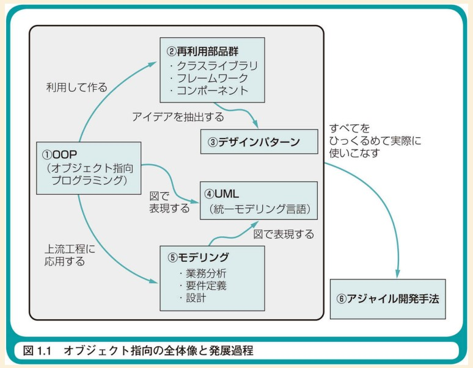

# Pythonとオブジェクト指向

## はじめに
オブジェクト指向は理解すればとても便利なもの。  
しかし、オブジェクト指向そのものが理解しがたい概念であり言語によっても解釈が違う。  
本発表では、簡単なオブジェクト指向のおさらいと、Pythonの独特な言語設計について触れる。

## 目次
1. オブジェクト指向を使う目的
2. Pythonにおけるオブジェクト指向プログラミング

## 1. オブジェクト指向を使う目的

「オブジェクト指向でなぜ作るのか」にはこのように書かれている
> 「ソフトウェアを楽に作りたいから」

また、「Effective Python」にはこのように書かれている。
> オブジェクト指向プログラミング言語として、Pythonは、継承、ポリモルフィズム、カプセル化な
どの全機能をサポートしています。Pythonで仕事を片付けるには、新たなクラスを書いて、そのイン
タフェースと階層とから、どのように相互作用するかを定義することが必要なことがあります。
Pythonのクラスと継承により、プログラムのオブジェクトによる意図した振る舞いを簡単に表現で
きます。長期間にわたって、機能を改善したり拡張したりできます。要件が変化する環境において、
柔軟性をもたらします。これらをどのように使うべきかをよく知ることによって、保守可能なコードが
書けるのです。

機能の改善、拡張、要件変化への柔軟性がキーワードである。  

そして、アジャイル開発はオブジェクト指向から生まれた手法であり、相性が良い。

### オブジェクト指向設計原則OCP
オブジェクト指向設計原則の一つであるOCP(Open-Closed Principle)は、「既存のコードを修正することなしに拡張する」ことを目標にして作られた。  
以下のメリットがある。
1. すべての要件が決まらなくても早期に開発できる。
2. あとで要件が決まった段階で容易に追加が可能である。
3. 既存のコードの修正が少ないので、手戻りを抑えることができる。

OCPを理解することは難しいので、OCPを完全に守れない事が多い。
なので、変更箇所が分散しないように局所化させることにフォーカスして設計することが良いと考える。

## 参考資料
[1] オブジェクト指向でなぜつくるのか第3版  
[2] Effective Python 第2版日本語版  
[3] オブジェクト指向開発と開発プロセスの関連 https://www.intec.co.jp/company/itj/itj2/contents/14.pdf

